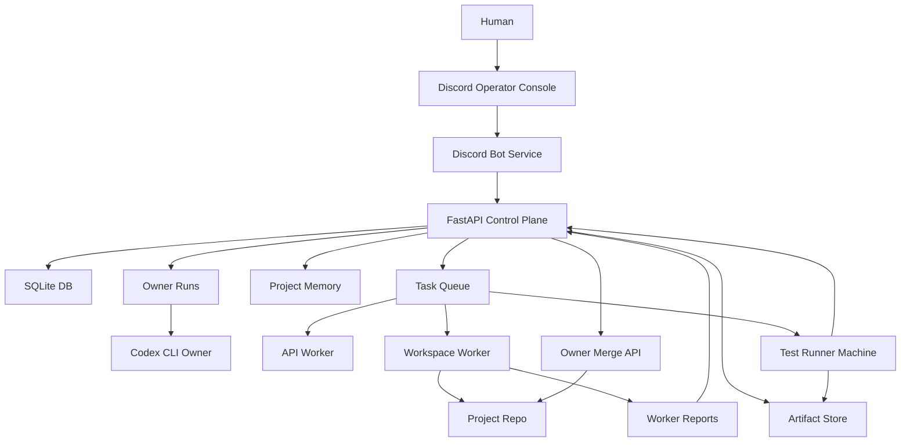

# AI Development Server v1 Architecture Blueprint

This is the first architecture overview future AI sessions should read.

It summarizes the current plan, implemented state, machine layout, role
boundaries, and document map. Detailed contracts live in the linked documents.

## One Sentence Summary

AI Development Server v1 is a control-plane server where the human talks to an
Owner AI through Discord, the Owner decomposes work into tasks, workers execute
small tasks in separate project repositories, test runners validate results, and
the server keeps memory, reports, artifacts, and approvals.

## Current Repository

Server repository:

```text
powerpunch080403/ai-game-company-server
```

Local workspace:

```text
C:\Users\user2\Documents\게임 개발 서버 v1개발
```

Main server target:

```text
powerpunch@100.92.73.19
/home/powerpunch/ai-game-company-server
```

The main server may be powered off. Do not require SSH for local design, docs,
schema work, or local tests.

## What Already Exists

The current codebase already has the core automation loop:

- FastAPI server.
- Token auth.
- SQLite storage.
- Project, Epic, Sub Epic, Task hierarchy.
- Typed memory records.
- Task lease, claim, report.
- Worker report history.
- Task event log.
- Owner dashboard and readiness summary.
- Owner run adapter.
- Model profile settings API.
- OpenAI-compatible API Worker.
- Workspace Worker for branch, command, commit, push, report.
- Owner merge API and merge candidate review.
- Retry, cancel, release, and assign-sub-epic operations.
- Project tree and task queue review APIs.
- Worker and Machine Registry APIs.
- Machine and Worker heartbeat endpoints.
- Worker last-seen updates from lease, claim, and report activity.
- Artifact metadata API.
- Artifact raw content upload and download API.
- Approval and decision record API.
- DB backup script.
- Remote deploy script.

## Current Design Direction

The server started as an AI game development company server. The long-term
direction is broader: games, apps, web services, tools, plugins, automation, and
other software projects.

Keep the system project-type aware, but do not hard-lock it to games only.

## Machine Layout

Detailed machine data lives in [HARDWARE_ENVIRONMENT.md](HARDWARE_ENVIRONMENT.md).

Known main server specs:

```text
CPU: Intel Core i5-14600KF
GPU: NVIDIA RTX 4070
RAM: 32 GB DDR5
OS: Ubuntu Desktop
```

Planned first test runner:

```text
CPU: Intel Core i5-12400
GPU: NVIDIA RTX 3060
```

Recommended placement:

- Main server: FastAPI, SQLite, Owner runs, Discord Bot, API Worker, optional
  Workspace Worker, backups.
- Test runner machine: project build/test/run, screenshots, videos, logs, visual
  checks, artifact upload.
- Future friend machines: extra workspace workers after registry/trust rules.
- Future local GPU workers: OpenAI-compatible local model or specialized GPU
  services, probably v1.5 or later.

Even though the main server has an RTX 4070, v1 should keep it stable first.
Heavy GPU/local LLM work should be added as a separate worker service after the
control plane is reliable.

## Runtime Topology



## Role Boundaries

Owner:

- Talks with the human.
- Understands intent.
- Designs projects.
- Splits work into epics, sub-epics, and tasks.
- Creates task plans.
- Reviews worker results.
- Decides retries, merges, and approvals.

API Worker:

- Helper AI for summaries, logs, drafts, analysis, and simple generation.
- Does not own task planning.
- Does not directly command code workers.

Workspace Worker:

- Executes assigned tasks in a project workspace.
- Uses `worker/` branches.
- Commits and reports results.

Test Runner:

- Runs build/test/runtime checks.
- Captures screenshots, videos, logs, and other evidence.
- Uploads artifacts to the server.

Discord Bot:

- Is the human-facing console bridge.
- Calls FastAPI APIs.
- Does not write SQLite directly.

FastAPI:

- Is the source of truth API.
- Owns SQLite access.
- Owns task state, memory, reports, approvals, artifacts, and registry APIs.

## Discord Operating Model

Detailed design: [DISCORD_OPERATOR_CONSOLE.md](DISCORD_OPERATOR_CONSOLE.md).

Discord is the v1 operator console.

Default global channels:

```text
#owner-room
#ai-dev-chat
#approval-inbox
#task-feed
#worker-reports
#test-runner
#artifacts
```

Default project threads:

```text
owner-design
owner-tasks
decisions
ai-internal
artifacts
test-runner
```

Important conversation rules:

- Project design stays inside project threads.
- Casual/general conversation can happen in `#owner-room`.
- Owner can answer project status from `#owner-room` by querying server state.
- User/Owner design channels are separate from AI-internal channels.
- AI-internal discussion is visible in early v1 for trust and debugging.
- Prompts should use summaries and scoped memory by default, not raw full chat
  logs.

## Project and Repository Model

Detailed template design: [GAME_PROJECT_TEMPLATE.md](GAME_PROJECT_TEMPLATE.md).

Server repo and project repos are separate.

Real projects:

- GitHub private repository by default.
- Created after approval in `#approval-inbox`.
- Project type is inferred by Owner unless ambiguous.

Temporary or test projects:

- May use local bare repos on the main server.

Preferred project metadata:

```text
.ai-company/
.game-company/  # compatibility path for game-focused configs
docs/
src/
tests/
```

The first real engine/framework is not selected yet. Ask before locking a real
project to Unity, Unreal, Godot, web framework, mobile framework, or similar.

## Memory and Logs

Detailed design: [LONG_TERM_PROJECT_MEMORY.md](LONG_TERM_PROJECT_MEMORY.md).

The server DB and project repositories are the source of truth, not raw Discord
history.

Memory layers:

- Global memory.
- Project memory.
- Thread summary memory.
- Task memory.
- Change summary log.
- Artifact memory.
- Release/milestone memory.

Search policy:

- Infer tags first.
- Filter candidates by tags.
- Expand summaries, report bodies, artifacts, and git refs only when needed.

Retention:

- Decisions, summaries, task reports, change logs, and git refs are kept
  indefinitely.
- Large ordinary artifact originals are kept for 30 days by default.
- Important/release/milestone artifacts are kept indefinitely.

## Artifacts and Visual Work

Detailed design: [VISUAL_TOOL_INTEGRATION.md](VISUAL_TOOL_INTEGRATION.md).

Artifacts include screenshots, videos, logs, build/test reports, web snapshots,
game runtime captures, and later Blender or scene snapshots.

Artifacts are uploaded to the main server and separated by project.

Recommended storage shape:

```text
artifacts/{project_slug}/{task_id_or_manual}/{artifact_id}/
```

Discord should show previews and links, but the server remains the durable
artifact index.

## Worker, Machine, Approval, and Artifact Registry

Detailed schema direction:
[WORKER_REGISTRY_AND_SCHEMA.md](WORKER_REGISTRY_AND_SCHEMA.md).

v1 should add minimal registries before the Discord bot becomes powerful:

- Worker registry.
- Machine registry.
- Discord channel/thread mapping.
- Approval/decision records.
- Artifact records.
- Memory/search metadata.

These registries make it possible to add friends' computers, a test runner
machine, GPU workers, and future local model workers without redesigning the
whole server.

## Owner Planning Contract

Detailed design: [OWNER_TASK_PLANNING.md](OWNER_TASK_PLANNING.md).

Owner owns planning.

Default worker task size:

```text
about 15 minutes
```

Worker branch rule:

```text
worker/*
```

Owner should stop and ask when work is risky, costly, public, destructive,
security-sensitive, hard to reverse, release-impacting, direction-changing, or
ambiguous.

Routine local docs, local tests, task decomposition, and conservative defaults
do not need separate user approval.

## Test Runner Contract

Detailed design: [TEST_RUNNER_CONTRACT.md](TEST_RUNNER_CONTRACT.md).

The test runner is a worker role. It leases tasks, runs validation, uploads
artifacts, and reports evidence.

Project test config:

```text
.game-company/test_runner.json
```

Later project templates may also use:

```text
.ai-company/test_runner.json
```

## Database and Queue

v1 uses SQLite.

SQLite stores projects, epics, sub-epics, tasks, memories, worker reports, task
events, owner runs, model profiles, future registries, and artifact metadata.

The task queue is the `tasks` table plus lease fields. A separate broker is not
needed in v1.

Postgres or a distributed queue should wait until v1.5 or later, when parallel
workers and multiple machines become heavy enough to justify it.

## External Access and Security

Default operating interface:

```text
Discord
```

Admin/recovery path:

```text
Tailscale + SSH
```

Rules:

- Do not expose raw `:8080` publicly.
- Use token auth for API access.
- Use HTTPS reverse proxy or tunnel before public web/API access.
- Store secrets in `.env` or service manager environment.
- Do not store raw API keys or GitHub tokens in SQLite.
- Store only environment variable names in model profiles.

## systemd Direction

FastAPI should become always-on first.

Workers should remain separately manageable:

- API Worker service/timer.
- Workspace Worker service/timer.
- Test Runner service/timer.
- Backup service/timer.
- Discord Bot service.

Do not turn on automatic worker loops until manual behavior is stable and cost
or destructive-action risks are understood.

## v1 Scope

Do in v1:

- Keep one reliable FastAPI main server.
- Keep SQLite.
- Keep project repos separate from the server repo.
- Add core registries and artifact APIs.
- Keep FastAPI routes organized under `app/api/routes` so Discord, artifact,
  worker, and Owner features can grow independently.
- Prepare Discord bot integration.
- Add test runner wrapper/report mapping.
- Add project scaffold/template tooling.
- Keep public raw API exposure disabled.
- Use OpenAI-compatible API Worker first.
- Keep local LLM/GPU worker as an extension point.

## v1.5 or Later

Defer:

- Multi-worker parallel workspaces.
- Postgres.
- Distributed queue backend.
- Rich web UI.
- Vector memory search.
- Managed local LLM service.
- GPU worker orchestration.
- Claude CLI or other CLI worker adapters unless the user asks.
- Full visual pipeline automation.

## Document Map

Read in this order:

1. [CONTEXT_HANDOFF.md](CONTEXT_HANDOFF.md) - current state and continuation
   notes.
2. [ARCHITECTURE_BLUEPRINT.md](ARCHITECTURE_BLUEPRINT.md) - this overview.
3. [HARDWARE_ENVIRONMENT.md](HARDWARE_ENVIRONMENT.md) - machines and specs.
4. [V1_DESIGN.md](V1_DESIGN.md) - current product/server design.
5. [ROADMAP.md](ROADMAP.md) - implementation priorities.
6. [SERVER_CONFIGURATION.md](SERVER_CONFIGURATION.md) - runtime configuration.
7. [SERVER_CONFIGURATION_DECISIONS.md](SERVER_CONFIGURATION_DECISIONS.md) -
   user decisions and defaults.
8. [DISCORD_OPERATOR_CONSOLE.md](DISCORD_OPERATOR_CONSOLE.md) - Discord UX.
9. [OWNER_TASK_PLANNING.md](OWNER_TASK_PLANNING.md) - Owner planning contract.
10. [WORKER_REGISTRY_AND_SCHEMA.md](WORKER_REGISTRY_AND_SCHEMA.md) - core
    registries and schema direction.
11. [LONG_TERM_PROJECT_MEMORY.md](LONG_TERM_PROJECT_MEMORY.md) - memory,
    summaries, and retrieval.
12. [VISUAL_TOOL_INTEGRATION.md](VISUAL_TOOL_INTEGRATION.md) - visual artifacts
    and MCP/tool integration.
13. [TEST_RUNNER_CONTRACT.md](TEST_RUNNER_CONTRACT.md) - validation worker.
14. [GAME_PROJECT_TEMPLATE.md](GAME_PROJECT_TEMPLATE.md) - project scaffolds.

## Current Next Implementation Recommendation

Before writing the Discord bot, continue the server-side foundation:

Done:

- Worker and machine registry.
- Machine and Worker heartbeat.
- Worker `last_seen_at` update from task lease, claim, and report activity.
- Artifact metadata records.
- Artifact raw content upload/download.
- Approval/decision records.

Next:

1. Discord mapping records.
2. Memory tag/search helpers.
3. Test runner wrapper/report mapping.
4. Project scaffold script.
