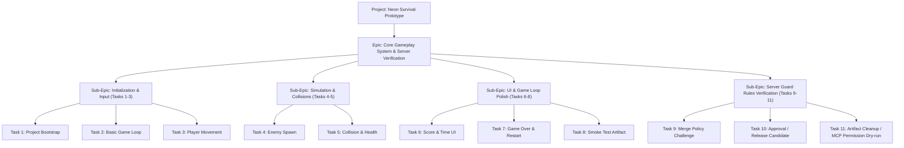

# First Portfolio Game Seed Draft: Neon Survival Prototype & Verification Harness

이 문서는 AI Game Company Server 데이터베이스에 등록할 프로젝트, 에픽, 서브에픽 및 작업(Task)들의 초기 Seed 데이터 초안입니다. 실제 데이터베이스에 실행 등록되지는 않으며, Codex CLI 사용 제한이 해제되는 대로 시드 스크립트 작성에 바로 사용할 수 있도록 정형화된 JSON 명세 구조를 갖추고 있습니다.

---

## 1. Hierarchy & Structural Definition



---

## 2. Seed JSON Draft

이 JSON 데이터는 `data/game_company.sqlite3`에 레코드로 직접 입력되거나 시드 스크립트(`scripts/seed_portfolio_game.py`)에서 불러와 로드할 수 있는 스키마입니다.

```json
{
  "project": {
    "name": "Neon Survival Prototype",
    "description": "2D neon-style top-down survival game developed using Pygame-ce. Functions as a dual portfolio showcase and E2E verification harness for all AI Game Company Server safeguards.",
    "engine": "pygame",
    "repo_url": "https://github.com/powerpunch080403/neon-survival-prototype.git",
    "workspace_path": "C:\\Users\\user2\\.gemini\\antigravity\\scratch\\neon-survival-workspace",
    "base_branch": "main"
  },
  "epics": [
    {
      "name": "Core Gameplay System & Server Verification",
      "description": "Establish controls, simulation components, GUI status display, and verify server-side policies (Merge guards, Discord gateway approvals, cleanup script, and MCP guards)."
    }
  ],
  "sub_epics": [
    {
      "epic_name": "Core Gameplay System & Server Verification",
      "name": "Initialization & Input",
      "description": "Setup project structures, standard game loops, and WASD control inputs."
    },
    {
      "epic_name": "Core Gameplay System & Server Verification",
      "name": "Simulation & Collisions",
      "description": "Setup enemy spawns and collision damage equations."
    },
    {
      "epic_name": "Core Gameplay System & Server Verification",
      "name": "UI & Game Loop Polish",
      "description": "Setup UI HUD status displays and automatic smoke testing."
    },
    {
      "epic_name": "Core Gameplay System & Server Verification",
      "name": "Server Guard Rules Verification",
      "description": "Verify Merge Policy barriers, Discord natural language approvals, and safety dry-runs."
    }
  ],
  "tasks": [
    {
      "sub_epic_name": "Initialization & Input",
      "goal": "Initialize the project directory with .game-company scaffolding and baseline directories.",
      "role": "code_worker",
      "branch": "worker/project-bootstrap",
      "estimated_minutes": 30,
      "requirements": [
        "1. Create the base project structure containing src/game/, tests/, scripts/, assets/, and docs/ subdirectories.",
        "2. Define the .game-company/project.json specifying project metadata and engine type.",
        "3. Define .game-company/test_runner.json configured with virtual env setup, pytest execution, and headless variables.",
        "4. Create requirements.txt with 'pygame-ce>=2.5.0' or 'pygame>=2.5.0'.",
        "5. Initialize a baseline .gitignore targeting Pycache, local logs, and virtual environments (.venv)."
      ],
      "success_criteria": [
        "Requirements file (requirements.txt) exists and lists Pygame dependencies.",
        ".game-company/test_runner.json exists and validates correctly against the Test Runner schema.",
        "Directories 'src/game', 'tests', and 'scripts' exist on the workspace file system."
      ],
      "evidence_required": "Workspace worker output logs from project init showing folder layout creation.",
      "memory_refs": ["project_rules", "project_knowledge"]
    },
    {
      "sub_epic_name": "Initialization & Input",
      "goal": "Create the main entry point running a standard Pygame game loop.",
      "role": "code_worker",
      "branch": "worker/basic-game-loop",
      "estimated_minutes": 20,
      "requirements": [
        "1. Create src/game/settings.py defining constants (SCREEN_WIDTH=800, SCREEN_HEIGHT=600, FPS=60, BG_COLOR=(20, 20, 25)).",
        "2. Create src/game/main.py implementing initialization of pygame (pygame.init()), screen window (800x600), caption 'Neon Survival Prototype', and standard game loop.",
        "3. Within the loop, capture pygame.QUIT events to terminate gracefully.",
        "4. Fill screen with BG_COLOR and call pygame.display.flip() / clock.tick(FPS) every frame.",
        "5. Support running headless if SDL_VIDEODRIVER=dummy is present in environment."
      ],
      "success_criteria": [
        "Running python -m src.game.main in dummy mode launches and exits without raising exceptions.",
        "Settings constants are correctly imported and applied in main.py loop."
      ],
      "evidence_required": "Test runner execution logs verifying the basic game loop executes and exits gracefully.",
      "memory_refs": ["coding_rules"]
    },
    {
      "sub_epic_name": "Initialization & Input",
      "goal": "Implement WASD player keyboard control and boundary check logic.",
      "role": "code_worker",
      "branch": "worker/player-movement",
      "estimated_minutes": 25,
      "requirements": [
        "1. Create src/game/player.py containing the Player class initialized with position (x, y), speed (e.g. 5 pixels/frame), and size (radius=15).",
        "2. Implement update(keys) method inside Player class mapping pygame.K_w, pygame.K_a, pygame.K_s, pygame.K_d keys to movement calculations.",
        "3. Constrain player's position (x, y) so they cannot cross screen borders defined by settings.py (0 to SCREEN_WIDTH, 0 to SCREEN_HEIGHT).",
        "4. Add render(screen) method to draw the player as a glowing neon cyan circle (pygame.draw.circle).",
        "5. Instantiate Player in src/game/main.py and call update() and render() inside the main game loop.",
        "6. Create tests/test_player.py verifying boundary checks and move operations (mocking keys pressed)."
      ],
      "success_criteria": [
        "Unit tests in tests/test_player.py pass (asserting that pressing W moves player up, and border limits restrict further movement).",
        "Player rendering does not throw errors when pygame window is updated."
      ],
      "evidence_required": "Pytest logs (test.log) showing 100% success on player boundary and motion calculation tests.",
      "memory_refs": ["coding_rules", "project_knowledge"]
    },
    {
      "sub_epic_name": "Simulation & Collisions",
      "goal": "Implement an enemy manager that spawns enemies periodically at random positions off-screen.",
      "role": "code_worker",
      "branch": "worker/enemy-spawn",
      "estimated_minutes": 25,
      "requirements": [
        "1. Create src/game/enemy.py with Enemy class having position, speed, size (radius=10), and target direction.",
        "2. Create src/game/enemy_manager.py managing an active list of enemies.",
        "3. Spawn enemies off-screen (outside 800x600 area) every 1.5 seconds, moving toward the player's coordinate.",
        "4. Draw enemies as neon red circles on the screen."
      ],
      "success_criteria": [
        "Unit tests confirm that enemy position updates reduce distance to player.",
        "Spawn timer correctly triggers list growth."
      ],
      "evidence_required": "Pytest logs containing enemy update tests.",
      "memory_refs": ["project_knowledge"]
    },
    {
      "sub_epic_name": "Simulation & Collisions",
      "goal": "Detect player-enemy collisions and subtract player health points.",
      "role": "code_worker",
      "branch": "worker/collision-health",
      "estimated_minutes": 20,
      "requirements": [
        "1. Create src/game/collision.py with check_collision(player, enemy) using circle distance overlap equations.",
        "2. Initialize player health to 100 in Player class.",
        "3. On collision, subtract 20 health and clear/bounce the colliding enemy to prevent continuous damage.",
        "4. Trigger state change to GAME_OVER if health <= 0.",
        "5. Write tests/test_collision.py mocking overlap coordinates."
      ],
      "success_criteria": [
        "Collision unit tests pass.",
        "Health is correctly reduced upon overlaps."
      ],
      "evidence_required": "Unit test reports showing collision tests passed.",
      "memory_refs": ["coding_rules"]
    },
    {
      "sub_epic_name": "UI & Game Loop Polish",
      "goal": "Render the current elapsed time and player score on the screen using Pygame fonts.",
      "role": "code_worker",
      "branch": "worker/score-time-ui",
      "estimated_minutes": 30,
      "requirements": [
        "1. Create src/game/ui.py for UI rendering utilities.",
        "2. Load default font (pygame.font.Font) or system default font.",
        "3. Draw elapsed survival time (seconds) and player health/score on the screen top-left corner.",
        "4. Ensure Font initialization doesn't raise exception in headless execution."
      ],
      "success_criteria": [
        "Font rendering operates correctly under SDL_VIDEODRIVER=dummy.",
        "Time/score strings are successfully generated and rendered."
      ],
      "evidence_required": "Headless run stdout verification log.",
      "memory_refs": ["coding_rules"]
    },
    {
      "sub_epic_name": "UI & Game Loop Polish",
      "goal": "Show a game over overlay when health hits 0, and support restarting via pressing space.",
      "role": "code_worker",
      "branch": "worker/game-over-restart",
      "estimated_minutes": 20,
      "requirements": [
        "1. Define PLAYING and GAME_OVER states in settings.py.",
        "2. If game over, display neon red 'GAME OVER' overlay and subtext 'Press SPACE to Restart'.",
        "3. When SPACE is pressed in GAME_OVER state, reset player health, survival timer, and clear enemy lists."
      ],
      "success_criteria": [
        "State transitions behave correctly (unittest verifies reset variables state).",
        "Spacebar resets game loops."
      ],
      "evidence_required": "Pytest logs verifying game state transition logic.",
      "memory_refs": ["project_knowledge"]
    },
    {
      "sub_epic_name": "UI & Game Loop Polish",
      "goal": "Implement a script that starts the game loop, takes a screen capture, and gracefully closes.",
      "role": "code_worker",
      "branch": "worker/smoke-test-artifact",
      "estimated_minutes": 30,
      "requirements": [
        "1. Write scripts/smoke_check.py importing pygame and src.game.main.",
        "2. Run main game loop under dummy driver for exactly 100 frames.",
        "3. Take a screenshot using pygame.image.save and output to .game-company/artifacts/screenshot.png.",
        "4. Exit program with status code 0."
      ],
      "success_criteria": [
        "screenshot.png is written, non-empty, and has correct resolution.",
        "Script completes within 10 seconds."
      ],
      "evidence_required": "screenshot.png file created in the artifacts folder.",
      "memory_refs": ["project_rules", "project_knowledge"]
    },
    {
      "sub_epic_name": "Server Guard Rules Verification",
      "goal": "Deliberately violate the Merge Review Policy to verify that invalid changes are blocked.",
      "role": "code_worker",
      "branch": "worker/merge-policy-challenge",
      "estimated_minutes": 20,
      "requirements": [
        "1. Create a synthetic validation pull request draft or document challenge that intentionally lacks test log evidence.",
        "2. Trigger a lease submit/merge request to the server.",
        "3. Verify that the Merge Review Policy checker correctly blocks the merge request and triggers a warning/block failure report."
      ],
      "success_criteria": [
        "The merge request is rejected by the server's policy checker.",
        "The main branch remains completely unaffected and game code is not broken."
      ],
      "evidence_required": "Server response status showing rejected merge for branch worker/merge-policy-challenge.",
      "memory_refs": ["coding_rules"]
    },
    {
      "sub_epic_name": "Server Guard Rules Verification",
      "goal": "Trigger Discord natural language approval flows and upload critical release artifacts.",
      "role": "code_worker",
      "branch": "worker/release-candidate",
      "estimated_minutes": 30,
      "requirements": [
        "1. Package the final codebase into a local release candidate artifact.",
        "2. Submit the merge request, registering it as a Release Candidate approval request.",
        "3. Simulate Discord approval flow using safe phrase/dry-run commands (e.g. '승인').",
        "4. Verify that the Discord gateway processes this response, updates DB approval status, and merges the branch.",
        "5. Upload the final build artifact marked with important=1 and release_or_milestone=1."
      ],
      "success_criteria": [
        "The branch is merged using safe phrase dry-run simulation.",
        "Release artifact metadata is correctly flagged."
      ],
      "evidence_required": "Discord Gateway log output and SQLite artifact metadata records.",
      "memory_refs": ["project_rules"]
    },
    {
      "sub_epic_name": "Server Guard Rules Verification",
      "goal": "Run dry-run checks on the workspace artifacts cleanup tool and MCP security guard rails.",
      "role": "code_worker",
      "branch": "worker/cleanup-mcp-dry-run",
      "estimated_minutes": 25,
      "requirements": [
        "1. Run 'python scripts/cleanup_artifacts.py' targeting the workspace folder in dry-run mode.",
        "2. Confirm that only expired, non-important files are listed as delete candidates, while critical release artifacts are untouched.",
        "3. Call validate_mcp_call() using filesystem config to verify attempts to access outside allowed roots or accessing '.env' are blocked.",
        "4. Generate docs/DEVELOPMENT_LOG.md summarizing all E2E verification metrics."
      ],
      "success_criteria": [
        "The cleanup script executes in dry-run mode without deleting any files.",
        "The console output lists correct expired logs but skips release files.",
        "MCP path confinement triggers 'is_allowed=False' for unauthorized files.",
        "docs/DEVELOPMENT_LOG.md exists and contains all E2E verification metrics."
      ],
      "evidence_required": "Command execution stdout console logs.",
      "memory_refs": ["project_rules"]
    }
  ]
}
```
