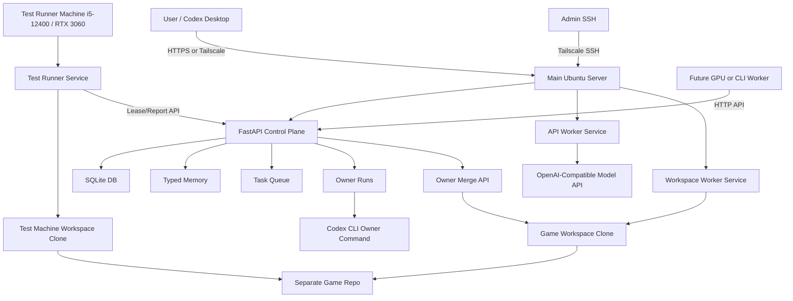

# Server Configuration Design

This document defines the recommended runtime configuration for AI Game
Company Server v1.

The goal is to make the current implementation deployable and understandable
without requiring the main computer to be online while this design is written.

## Operating Principles

- The control-plane server and game repositories are separate.
- SQLite is the v1 source of truth for project hierarchy, memory, task queue,
  reports, events, model profiles, and owner runs.
- Expensive intelligence is used by Owner. Cheaper API or local workers do
  repeated execution.
- Secrets live in environment files or service manager configuration, not in
  SQLite.
- v1 should run one main server reliably before adding distributed workers.
- Workers should be managed as separate processes/services even when they run
  on the same machine.
- Public external access is allowed by design, but raw unauthenticated `:8080`
  exposure is not. Use HTTPS, token auth, and preferably keep Tailscale/SSH as
  the admin recovery path.

User-facing deployment decisions are separated in
[SERVER_CONFIGURATION_DECISIONS.md](SERVER_CONFIGURATION_DECISIONS.md). Use that
document before enabling remote workers, public access, systemd timers, or paid
model changes.

Machine-specific known details and unknowns are tracked in
[HARDWARE_ENVIRONMENT.md](HARDWARE_ENVIRONMENT.md). Do not assume main server
disk capacity or test runner paths unless they are confirmed there. The main
server hardware currently documented there is Intel Core i5-14600KF, NVIDIA RTX
4070, 32 GB DDR5 RAM, and Ubuntu Desktop.

The high-level architecture map for future AI sessions is
[ARCHITECTURE_BLUEPRINT.md](ARCHITECTURE_BLUEPRINT.md).

## Recommended v1 Topology



## Main Server Components

Recommended main server path:

```text
<HOME_DIR>/ai-game-company-server
```

Components that run from this checkout:

- FastAPI server: `app.main:app`
- Discord Bot service: separate process that talks to FastAPI only
- SQLite database: `data/game_company.sqlite3`
- Owner run adapter: `/owner/runs`
- API worker service: `python -m app.api_worker`
- Workspace worker service: `python -m app.workspace_worker`
- Backup command: `python -m app.backup_db`
- Deploy/update scripts

The main server has enough hardware to host future local GPU or local LLM worker
services. For v1, keep those services separate from FastAPI and do not make the
control plane depend on GPU availability.

Workers are managed separately from the FastAPI service. In v1 they may run on
the main server for convenience, but they should have separate commands, logs,
and later separate systemd units.

Discord Bot is also managed separately from FastAPI. It should not import or
write SQLite directly. It should call FastAPI APIs so the same design works when
the bot later moves to another process, container, or machine.

The Test Runner is designed around a separate i5-12400 / RTX 3060 machine. It
leases `test_runner` tasks from the main server and reports results back through
the API.

Recommended runtime directories:

```text
<HOME_DIR>/ai-game-company-server/
  .env
  data/
    game_company.sqlite3
    server.out.log
    server.err.log
    server.pid
  backups/
  owner-runs/
  runs/
```

The current `scripts/start_server.sh` already starts FastAPI with nohup and
writes logs under `data/`.

## Development Server vs Game Project Separation

The development server repository is this project:

```text
powerpunch080403/ai-game-company-server
```

It contains:

- FastAPI server.
- Worker runners.
- Merge tooling.
- Deployment and backup scripts.
- Server documentation.

Game project repositories must be separate. They contain:

- Game code and assets.
- `.game-company/project.json`
- `.game-company/test_runner.json`
- Project docs.
- Engine-specific configuration after engine selection.

Recommended paths on the main server:

```text
<HOME_DIR>/ai-game-company-server
<HOME_DIR>/game-repos/{project}.git
<HOME_DIR>/game-workspaces/{project}
```

For GitHub-hosted game repos, `repo_url` should point to GitHub. For local
bare repos, `repo_url` can point to `<HOME_DIR>/game-repos/{project}.git`.

## Workspace Model

Current implementation stores one `workspace_path` per project.

v1 initial safe operating rule:

- Run at most one workspace-mutating process per project workspace at a time.
- Do not run a workspace worker while Owner merge is using the same workspace.
- Use `worker/` branches for all worker changes.
- Owner merge is the only path that merges worker branches into the base branch.

This is intentionally simple for the first version. The design must leave room
for friends or additional machines to work in parallel later.

Future workspace model:

```text
<HOME_DIR>/game-workspaces/{project}/main
<HOME_DIR>/game-workspaces/{project}/workers/{worker_id}
<HOME_DIR>/game-workspaces/{project}/test-runners/{machine_id}
```

Per-worker workspaces or git worktrees should be added when parallel workers
become necessary.

## Component Execution

### FastAPI Control Plane

Current command:

```bash
./scripts/start_server.sh
```

Equivalent direct command:

```bash
.venv/bin/python -m uvicorn app.main:app --host 0.0.0.0 --port 8080
```

The server exposes:

- health check
- project tree API
- memory API
- task queue API
- worker lease/claim/report API
- Owner dashboard/readiness/history
- Owner run adapter
- model profile settings
- merge review and merge execution

### Owner

Owner is a high-cost reasoning role.

Current v1 connection point:

```text
GAME_COMPANY_OWNER_COMMAND
```

The server writes an Owner prompt into:

```text
owner-runs/owner-run-{id}/prompt.md
```

Then it runs the configured command. The command may receive the prompt through
stdin, or may use placeholders:

```text
{prompt_file}
{run_dir}
```

Recommended v1 modes:

- Dry run first through `/owner/runs` with `dry_run=true`.
- Use Codex CLI as the Owner command when available.
- Store the command output in the `owner_runs` table.
- Let the human review Owner output before creating risky tasks.

Plain explanation:

- The server writes a planning prompt file.
- Codex CLI is called once to read that file.
- The result is saved to the database and run directory.
- Owner is not an always-running loop in v1; it is called when expensive
  reasoning is needed.

Example shape:

```env
GAME_COMPANY_OWNER_COMMAND='codex exec --full-auto --model <owner-model> --prompt-file {prompt_file}'
GAME_COMPANY_OWNER_TIMEOUT_SECONDS=900
GAME_COMPANY_OWNER_RUNS_DIR=<HOME_DIR>/ai-game-company-server/owner-runs
```

The exact Codex CLI flags should be verified locally before making this a
systemd service command.

### API Worker

API Worker uses an OpenAI-compatible Chat Completions API.

Current command:

```bash
./scripts/run_api_worker.sh --worker-id api-code-1 --role code_worker
```

Configuration sources:

1. Enabled model profile for the task role from `/owner/model-profiles/{role}`.
2. Environment fallback values.

Environment fallback:

```env
GAME_COMPANY_WORKER_API_BASE_URL=https://api.openai.com/v1
GAME_COMPANY_WORKER_API_KEY=...
GAME_COMPANY_WORKER_MODEL=...
GAME_COMPANY_WORKER_TIMEOUT_SECONDS=120
GAME_COMPANY_WORKER_TEMPERATURE=0.2
```

Model profile records may store:

- provider
- model
- base_url
- api_key_env
- temperature
- max_tokens
- enabled
- notes

Secrets must not be stored in model profiles. Store only the env var name in
`api_key_env`.

### Workspace Worker

Workspace Worker runs a shell command inside a prepared game workspace branch.

Current command:

```bash
./scripts/run_workspace_worker.sh \
  --worker-id workspace-code-1 \
  --role code_worker \
  --command "your-command"
```

Behavior:

- Leases only tasks with project repo/workspace config.
- Prepares the git workspace.
- Checks out or creates the task `worker/` branch.
- Runs the command.
- Commits changed files unless `--no-commit`.
- Optionally pushes the worker branch.
- Reports result.

Recommended v1 use:

- Run manually or as a one-shot service/timer.
- Keep one workspace worker per project workspace.
- Prefer `--push` when Owner merge runs on the main server.
- Keep commands explicit and narrow.

### Test Runner

Test Runner is a worker role, not a separate control plane.

v1 execution options:

- Run it on the planned i5-12400 / RTX 3060 test machine.
- Use `app.workspace_worker` with `--role test_runner` and a test command as the
  first bridge.
- Add a wrapper script that reads `.game-company/test_runner.json`.

Recommended command shape after wrapper exists:

```bash
./scripts/run_test_runner.sh --worker-id test-runner-1
```

Until that wrapper exists:

```bash
./scripts/run_workspace_worker.sh \
  --worker-id test-runner-1 \
  --role test_runner \
  --command "./scripts/project-test-command.sh"
```

Test artifacts belong in the game project workspace under:

```text
.game-company/artifacts/task-{task_id}/run-{timestamp}/
```

The test machine keeps its own workspace clone while running tests, then uploads
artifacts to the main server. Artifact storage on the server is separated by
project. The server report stores summaries, changed files, test evidence,
issues, and artifact metadata.

## SQLite, Memory DB, and Task Queue Placement

SQLite database path:

```env
GAME_COMPANY_DB_PATH=<HOME_DIR>/ai-game-company-server/data/game_company.sqlite3
```

The same SQLite database stores:

- projects
- epics
- sub epics
- tasks
- typed memories
- worker reports
- task events
- owner runs
- model profiles

Task queue is not a separate broker in v1. It is the `tasks` table plus lease
fields:

- `status`
- `leased_by`
- `leased_until`
- `retry_count`

This is enough for v1. A separate queue system can wait until there are many
parallel workers.

## Local LLM and GPU Worker Extension

v1 should treat local LLM/GPU workers as another OpenAI-compatible endpoint
when possible.

Recommended future options:

- Run local model server on a GPU machine.
- Expose it only over Tailscale.
- Add a model profile with `base_url` pointing to the local endpoint.
- Use the same API Worker for text/code tasks.
- Add specialized workers only when the generic API Worker is insufficient.

Example future profile:

```json
{
  "role": "code_worker",
  "provider": "local-openai-compatible",
  "model": "local-code-model",
  "base_url": "http://100.x.y.z:8000/v1",
  "api_key_env": "LOCAL_WORKER_API_KEY",
  "temperature": 0.1,
  "max_tokens": 4096,
  "enabled": true,
  "notes": "GPU worker reachable only over Tailscale."
}
```

GPU workers that need repository access should still call the central server
for task lease/report, then use their own isolated workspace path.

This requires a v1.5 schema or convention for per-machine workspace paths.

## Tailscale and SSH Network Structure

Recommended network:

```text
Windows laptop / Codex Desktop
  -> Discord for normal operation
  -> HTTPS public endpoint later if needed
  -> Tailscale SSH/HTTP for admin recovery
Main Ubuntu server <REMOTE_HOST>
  -> HTTP API for worker lease/report
12400 / RTX 3060 test runner machine
  -> lease/report API over HTTPS or Tailscale
  -> git access to game repo
```

Rules:

- Bind FastAPI to `0.0.0.0` only when the host firewall and Tailscale exposure
  are understood.
- Do not expose raw port 8080 directly on the public internet.
- Put public access behind HTTPS reverse proxy or tunnel only when needed.
- Keep API tokens required for non-public paths.
- Use role-scoped tokens for normal operation instead of sharing the admin
  token with every worker.
- Prefer Tailscale/SSH for admin operations and recovery.
- Use SSH for deploy, recovery, and manual inspection.
- Use HTTP API for workers and Owner control-plane operations.

## Security and Secret Management

Required v1 security baseline:

- Set at least one API token on any non-local server.
- Treat `GAME_COMPANY_API_TOKEN` as a legacy/admin break-glass token.
- Prefer role-scoped tokens:
  - `GAME_COMPANY_OWNER_TOKEN` for Owner operations, merge, approval, and
    project/task management.
  - `GAME_COMPANY_WORKER_TOKEN` for lease, claim, report, and task package
    reads.
  - `GAME_COMPANY_READONLY_TOKEN` for dashboard and other `GET` reads.
  - `GAME_COMPANY_ARTIFACT_TOKEN` for artifact metadata and content transfer.
- Pass token as `Authorization: Bearer ...`.
- Worker command execution uses a v1 command safety gate:
  - Dangerous patterns such as `rm -rf`, `curl | bash`, encoded PowerShell,
    `git push --force`, and `git reset --hard` are blocked.
  - Optional `GAME_COMPANY_ALLOWED_COMMAND_PREFIXES` can restrict worker
    commands to known prefixes such as `python -m pytest` or `npm test`.
- Artifact uploads use `GAME_COMPANY_MAX_ARTIFACT_UPLOAD_BYTES`; default is
  100 MiB. Large video/build artifacts should be split or moved to later object
  storage before v1.5.
- For public access, use HTTPS in front of the API.
- Do not expose raw uvicorn directly to the public internet.
- Store `.env` on the server only.
- Do not commit `.env`.
- Do not store raw API keys in SQLite model profiles.
- Store only environment variable names such as `GAME_COMPANY_WORKER_API_KEY`.
- Keep Git credentials or deploy keys outside the database.
- Restrict remote access to Tailscale and SSH users.

### Node Identity and Modes

- `GAME_COMPANY_NODE_ID`: Unique identity of this control-server node.
- `GAME_COMPANY_NODE_MODE`: Use `authority` for the central project control server.

### Discord Task-Thread Configuration

- `DISCORD_BOT_TOKEN`: Discord Bot API authentication token.
- `GAME_COMPANY_DISCORD_TASK_CHANNEL_ID`: Discord text channel where task threads are created.

Recommended `.env` skeleton:

```env
GAME_COMPANY_DB_PATH=<HOME_DIR>/ai-game-company-server/data/game_company.sqlite3
GAME_COMPANY_HOST=0.0.0.0
GAME_COMPANY_PORT=8080
GAME_COMPANY_NODE_ID=
GAME_COMPANY_NODE_MODE=authority
GAME_COMPANY_API_TOKEN=replace-with-generated-admin-token
GAME_COMPANY_OWNER_TOKEN=replace-with-generated-owner-token
GAME_COMPANY_WORKER_TOKEN=replace-with-generated-worker-token
GAME_COMPANY_READONLY_TOKEN=replace-with-generated-readonly-token
GAME_COMPANY_ARTIFACT_TOKEN=replace-with-generated-artifact-token
GAME_COMPANY_ALLOWED_COMMAND_PREFIXES=python -m pytest,npm test
GAME_COMPANY_BACKUP_DIR=<HOME_DIR>/ai-game-company-server/backups
GAME_COMPANY_ARTIFACT_ROOT=<HOME_DIR>/ai-game-company-server/artifacts
GAME_COMPANY_MAX_ARTIFACT_UPLOAD_BYTES=104857600
DISCORD_BOT_TOKEN=
GAME_COMPANY_DISCORD_TASK_CHANNEL_ID=

GAME_COMPANY_OWNER_COMMAND=
GAME_COMPANY_OWNER_TIMEOUT_SECONDS=900
GAME_COMPANY_OWNER_RUNS_DIR=<HOME_DIR>/ai-game-company-server/owner-runs

GAME_COMPANY_WORKER_API_BASE_URL=https://api.openai.com/v1
GAME_COMPANY_WORKER_API_KEY=
GAME_COMPANY_WORKER_MODEL=
GAME_COMPANY_WORKER_TIMEOUT_SECONDS=120
GAME_COMPANY_WORKER_TEMPERATURE=0.2
```

## Backup, Logs, and Recovery

### Backups

Current backup command:

```bash
./scripts/backup_db.sh
```

Recommended v1 policy:

- Backup SQLite before deploy.
- Backup SQLite before schema changes.
- Keep daily backups for the last 7 days.
- Keep weekly backups for the last 4 weeks.
- Store backups under `backups/`.
- Copy important backups off the main server when convenient.

### Logs

Current server logs:

```text
data/server.out.log
data/server.err.log
```

Recommended additional logs:

```text
logs/api-worker.log
logs/workspace-worker.log
logs/test-runner.log
logs/backup.log
```

For systemd, use journald as the primary service log and keep file logs only
for worker command artifacts.

### Recovery

Minimal recovery steps:

1. Restore server checkout.
2. Restore `.env`.
3. Restore `data/game_company.sqlite3` from backup.
4. Install dependencies.
5. Start FastAPI.
6. Check `/health`.
7. Check `/owner/readiness`.
8. Inspect pending/running queue.
9. Release stale running tasks if needed.

Do not auto-cancel Task 1 or other known placeholders without user approval.

## Systemd Always-On Design

Systemd is Linux's service manager. It can start the server automatically when
the main computer boots, restart it if it crashes, and run scheduled one-shot
worker jobs through timers.

Recommended split:

- v1: make FastAPI always-on with systemd.
- v1 later: add worker timers only after manual worker behavior is safe.

### FastAPI Service

```text
ai-game-company-server.service
```

Purpose:

- Always run FastAPI.
- Restart on failure.
- Load `<HOME_DIR>/ai-game-company-server/.env`.
- Working directory is the server checkout.

### API Worker Timer

```text
ai-game-company-api-worker.service
ai-game-company-api-worker.timer
```

Purpose:

- Poll for cheap API worker tasks.
- Run one task per invocation.
- Exit cleanly when no task is available.
- Timer controls frequency and cost.

### Workspace Worker Timer

```text
ai-game-company-workspace-worker.service
ai-game-company-workspace-worker.timer
```

Purpose:

- Run one workspace task at a time.
- Use project workspace config.
- Commit/push worker branches when configured.
- Keep timer frequency conservative to avoid workspace collisions.

### Test Runner Timer

```text
ai-game-company-test-runner.service
ai-game-company-test-runner.timer
```

Purpose:

- Lease `test_runner` tasks.
- Run build/test commands from project config.
- Record artifacts.
- Report evidence.
- This service is intended for the 12400 / RTX 3060 test machine.

### Backup Timer

```text
ai-game-company-backup.service
ai-game-company-backup.timer
```

Purpose:

- Run SQLite backup on a schedule.
- Keep retention policy.
- Log backup path and result.

### Owner Service

Owner should not be an always-looping service in v1.

Recommended:

- Trigger Owner through `/owner/runs`.
- Use dry-run first.
- Run Codex CLI on demand.
- Require human review for decision gates.

## v1 Scope

Do in v1:

- Run one FastAPI main server.
- Use SQLite as the source of truth.
- Keep game repos separate from the server repo.
- Use one project workspace path safely.
- Keep worker services separately manageable.
- Design Test Runner around the 12400 / RTX 3060 test machine.
- Use token auth.
- Support public access through HTTPS reverse proxy or tunnel.
- Use `.env` for secrets.
- Use Owner dry runs and Codex CLI command adapter.
- Use OpenAI-compatible API Worker model profiles.
- Use Workspace Worker for git branch/commit/push/report.
- Define Test Runner contract and add a simple runner wrapper.
- Add backup and recovery documentation.
- Optionally add systemd unit files after manual scripts are stable.

## v1.5 or Later

Defer:

- Full parallel workspace workers per project.
- Postgres or distributed queue migration.
- Vector memory search.
- Web UI.
- Local model hosting as a managed service.
- GPU worker orchestration.
- Claude CLI or other CLI worker adapters unless the user asks for them.
- Image and voice worker pipelines.
- Merge warning threshold configuration.
- Rich artifact browser.
- Distributed queue backend.
- Full systemd hardening and log rotation policy.

## Open Decisions for the User Later

Ask the user before:

- Selecting the first real game engine.
- Enabling always-on systemd workers.
- Making merge warnings block merges.
- Choosing paid model profiles for each role.
- Running local GPU workers before API workers.
- Exposing any service beyond Tailscale.

Until then, the conservative default is:

- engine remains `undecided`
- merge warnings remain advisory
- workers run manually or by conservative timers
- secrets stay in `.env`
- SQLite remains the only database
