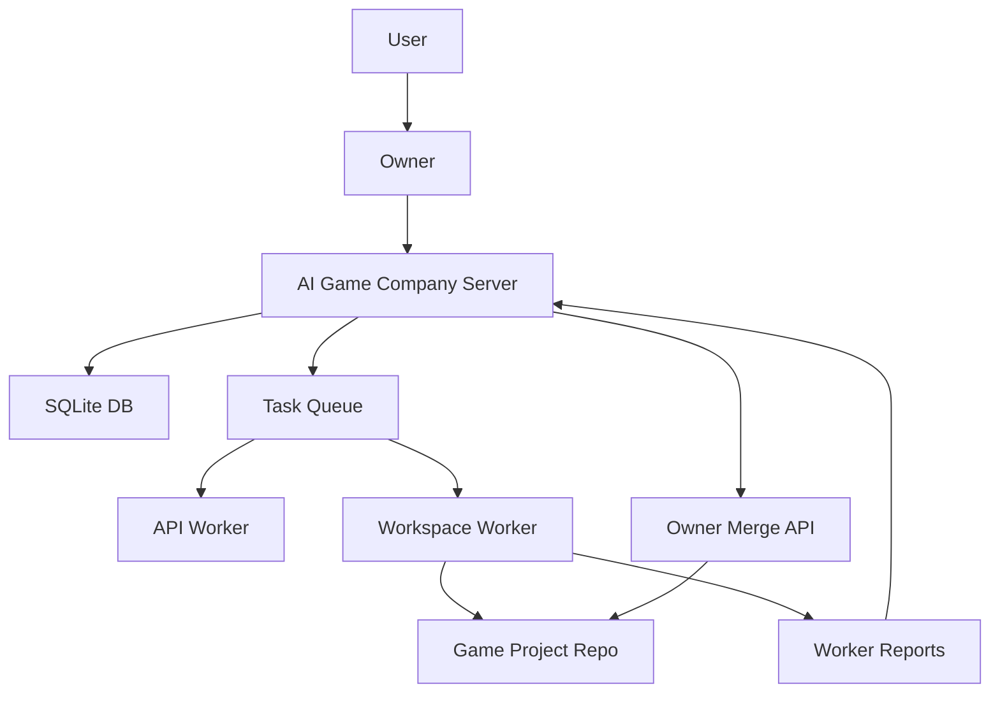

# AI Game Company Server v1 Design

## Purpose

This server coordinates an AI game development company:

- Owner decomposes requests into projects, epics, sub-epics, and tasks.
- Workers execute small tasks.
- Test runners validate builds and runtime behavior.
- Memory stores decisions and project knowledge, not raw conversation logs.

The first objective is a working automation loop, not a perfect platform.

Longer-term direction: the same server should be able to coordinate non-game
development projects such as apps, web services, tools, plugins, and automation.
The v1 wording remains game-focused because that is the first target, but
project metadata and memory should avoid hard-locking the system to games only.

## Core Philosophy

Use expensive intelligence sparingly.

- Owner = thinking, decomposition, review, merge decisions.
- Worker = execution, repetition, coding, simple fixes.
- Test Runner = build, run, profile, measure.

The server must make the cheap execution path easy and keep high-cost Owner calls rare.

## Current Architecture



Runtime server placement and operations are defined in
[SERVER_CONFIGURATION.md](SERVER_CONFIGURATION.md).

For the future-AI handoff map, read
[ARCHITECTURE_BLUEPRINT.md](ARCHITECTURE_BLUEPRINT.md) before changing runtime
design, Discord operations, memory, artifacts, or worker placement.

## Data Model

### Project Hierarchy

- Project
- Epic
- Sub Epic
- Task

### Task Contract

Each task must include:

- Goal
- Requirements
- Success Criteria
- Estimated Time
- Memory Refs
- Branch

Detailed planning rules live in [OWNER_TASK_PLANNING.md](OWNER_TASK_PLANNING.md).

### Memory Types

- design
- project_rules
- coding_rules
- project_knowledge
- art_guide
- narrative_guide
- task_history

Long-term project memory and change summary rules are defined in
[LONG_TERM_PROJECT_MEMORY.md](LONG_TERM_PROJECT_MEMORY.md).

### Model Profiles

Model profiles define role-level model settings:

- owner
- code_worker
- image_worker
- voice_worker
- test_runner

Secrets are not stored. Store env var names such as `GAME_COMPANY_WORKER_API_KEY`.

## Worker Lifecycle

Normal workspace worker flow:

1. Lease task requiring project config.
2. Fetch task package.
3. Prepare git workspace.
4. Checkout or create `worker/*` branch.
5. Run command.
6. Commit changed files.
7. Optionally push worker branch.
8. Report result.

Specific task flow:

1. Claim task.
2. Fetch package.
3. Run workspace command.
4. Report if requested.

Reports are rejected unless the reporting worker has leased or claimed the task.

## Owner Lifecycle

Owner responsibilities:

- Create hierarchy and tasks.
- Inspect queue readiness.
- Inspect worker reports.
- Retry, release, cancel, or assign tasks.
- Merge successful worker branches.
- Learn from task history.

Owner should not directly code except for small control-plane fixes.

Owner task planning in v1 is contract-first:

- Default worker task size is 15 minutes.
- Workspace task branches must start with `worker/`.
- Durable decisions are written as typed memory.
- User approval is required for engine selection, paid services, credential
  changes, destructive git operations, and merge-policy escalation.
- Routine decomposition, local docs, local tests, branch naming, and placeholder
  `undecided` engine values do not require user approval.

See [OWNER_TASK_PLANNING.md](OWNER_TASK_PLANNING.md).

## Test Runner Contract

The `test_runner` role validates builds, tests, runtime smoke checks, and
artifacts. It leases tasks through the same worker API and reports through the
existing worker report schema.

Project-local test configuration should live in:

```text
.game-company/test_runner.json
```

In v1, merge review still treats missing test evidence as a warning, not a hard
block. Owner may create a separate `test_runner` task before merge when code
worker evidence is weak.

See [TEST_RUNNER_CONTRACT.md](TEST_RUNNER_CONTRACT.md).

## Game Project Template

Game repositories are separate from this server repository. The default
template is engine-agnostic and minimal:

```text
.game-company/
docs/
src/
tests/
```

The engine should remain `undecided` until the user chooses the first real game
engine. Unity support is expected later, but the server must not require Unity.

See [GAME_PROJECT_TEMPLATE.md](GAME_PROJECT_TEMPLATE.md).

## Merge Policy

Current merge requirements:

- Task status is `success`.
- Latest worker report is `success`.
- Task belongs to a project.
- Project has `repo_url` and `workspace_path`.
- Branch starts with `worker/`.
- Task was not already merged.

Warnings:

- Report has no changed files.
- Report has no test evidence.
- Report contains issues.

Future stricter policy can block merge on warnings.

## Readiness Meaning

`/owner/readiness` returns ready if:

- owner profile exists.
- code_worker profile exists.
- no failed tasks require review.

Warnings do not block readiness:

- running tasks exist.
- pending tasks are not workspace-ready.

## Known Deliberate Placeholder

Task 1 is intentionally left as a pending orphan:

- Goal: `Create initial Unity repository skeleton`
- Reason: it should be revisited when the real Unity project starts.
- Current behavior: workspace workers skip it because it is not project-attached.

Do not auto-cancel or auto-assign Task 1 without user approval.
