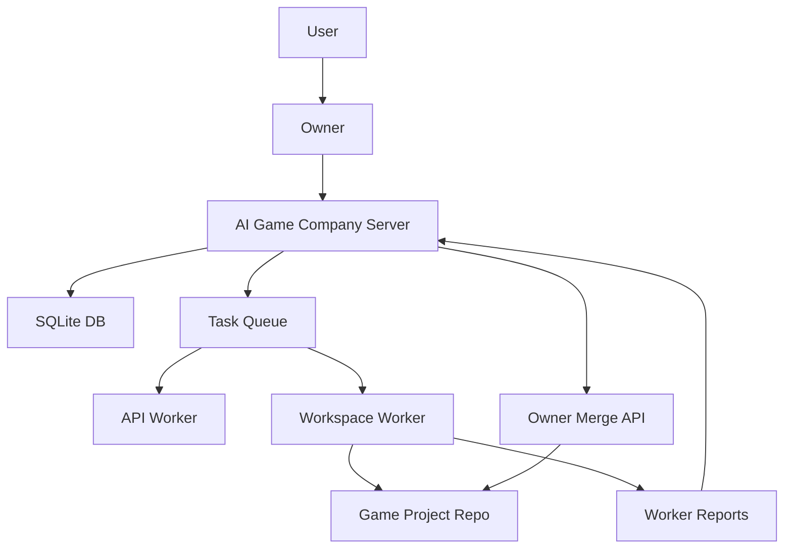

# AI Game Company Server v1 Design

## Purpose

This server coordinates an AI game development company:

- Owner decomposes requests into projects, epics, sub-epics, and tasks.
- Workers execute small tasks.
- Test runners validate builds and runtime behavior.
- Memory stores decisions and project knowledge, not raw conversation logs.

The first objective is a working automation loop, not a perfect platform.

Longer-term direction: the same server should be able to coordinate non-game
development projects such as apps, web services, tools, plugins, and automation.
The v1 wording remains game-focused because that is the first target, but
project metadata and memory should avoid hard-locking the system to games only.

## Core Philosophy

Use expensive intelligence sparingly.

- Owner = thinking, decomposition, review, merge decisions.
- Worker = execution, repetition, coding, simple fixes.
- Test Runner = build, run, profile, measure.

The server must make the cheap execution path easy and keep high-cost Owner calls rare.

## Current Architecture



Runtime server placement and operations are defined in
[SERVER_CONFIGURATION.md](SERVER_CONFIGURATION.md).

For the future-AI handoff map, read
[ARCHITECTURE_BLUEPRINT.md](ARCHITECTURE_BLUEPRINT.md) before changing runtime
design, Discord operations, memory, artifacts, or worker placement.

## Data Model

### Project Hierarchy

- Project
- Epic
- Sub Epic
- Task

### Task Contract

Each task must include:

- Goal
- Requirements
- Success Criteria
- Estimated Time
- Memory Refs
- Branch
- `base_commit` — git commit hash of the default branch at lease/claim time (nullable; None for orphan tasks or when git is unavailable)
- `write_scope` — allowed file path glob patterns (nullable list of strings)
- `read_scope` — read-only path globs (informational; nullable list of strings)
- `forbidden_scope` — patterns the task must never modify (nullable list of strings)

Detailed planning rules live in [OWNER_TASK_PLANNING.md](OWNER_TASK_PLANNING.md).

### Memory Types

- design
- project_rules
- coding_rules
- project_knowledge
- art_guide
- narrative_guide
- task_history

Long-term project memory and change summary rules are defined in
[LONG_TERM_PROJECT_MEMORY.md](LONG_TERM_PROJECT_MEMORY.md).

### Model Profiles

Model profiles define role-level model settings:

- owner
- code_worker
- image_worker
- voice_worker
- test_runner

Secrets are not stored. Store env var names such as `GAME_COMPANY_WORKER_API_KEY`.

## Worker Lifecycle

Normal workspace worker flow:

1. Lease task requiring project config.
2. Fetch task package.
3. Prepare git workspace.
4. Checkout or create `worker/*` branch.
5. Run command.
6. Commit changed files.
7. Optionally push worker branch.
8. Report result.

Specific task flow:

1. Claim task.
2. Fetch package.
3. Run workspace command.
4. Report if requested.

Reports are rejected unless the reporting worker has leased or claimed the task.

### Task Lease Invariant
* **One task has at most one active lease at a time**.
* A task is the atomic unit of worker responsibility. Allowing multiple workers to report against the same task simultaneously would make branch ownership, `base_commit` tracking, `changed_files` validation, `task_locks`, final status, and merge candidate creation ambiguous.

## Owner Lifecycle

Owner responsibilities:

- Create hierarchy and tasks.
- Inspect queue readiness.
- Inspect worker reports.
- Retry, release, cancel, or assign tasks.
- Merge successful worker branches.
- Learn from task history.

Owner should not directly code except for small control-plane fixes.

Owner task planning in v1 is contract-first:

- Default worker task size is 15 minutes.
- Workspace task branches must start with `worker/`.
- Durable decisions are written as typed memory.
- User approval is required for engine selection, paid services, credential
  changes, destructive git operations, and merge-policy escalation.
- Routine decomposition, local docs, local tests, branch naming, and placeholder
  `undecided` engine values do not require user approval.

See [OWNER_TASK_PLANNING.md](OWNER_TASK_PLANNING.md).

## Test Runner Contract

The `test_runner` role validates builds, tests, runtime smoke checks, and
artifacts. It leases tasks through the same worker API and reports through the
existing worker report schema.

Project-local test configuration should live in:

```text
.game-company/test_runner.json
```

In v1, merge review still treats missing test evidence as a warning, not a hard
block. Owner may create a separate `test_runner` task before merge when code
worker evidence is weak.

See [TEST_RUNNER_CONTRACT.md](TEST_RUNNER_CONTRACT.md).

## Game Project Template

Game repositories are separate from this server repository. The default
template is engine-agnostic and minimal:

```text
.game-company/
docs/
src/
tests/
```

The engine should remain `undecided` until the user chooses the first real game
engine. Unity support is expected later, but the server must not require Unity.

See [GAME_PROJECT_TEMPLATE.md](GAME_PROJECT_TEMPLATE.md).

## Merge Policy

Current merge requirements:

- Task status is `success`.
- Latest worker report is `success`.
- Task belongs to a project.
- Project has `repo_url` and `workspace_path`.
- Branch starts with `worker/`.
- Task was not already merged.

Task status values include: `pending`, `running`, `success`, `failed`, `blocked`, `canceled`, and:
- `needs_rebase` — reported as success but `base_commit` has moved; must be retried before merge
- `scope_violation` — modified files violate write_scope or forbidden_scope; must be retried before merge

Warnings:

- Report has no changed files.
- Report has no test evidence.
- Report contains issues.

Future stricter policy can block merge on warnings.

## Readiness Meaning

`/owner/readiness` returns ready if:

- owner profile exists.
- code_worker profile exists.
- no failed tasks require review.

Warnings do not block readiness:

- running tasks exist.
- pending tasks are not workspace-ready.

## Known Deliberate Placeholder

Task 1 is intentionally left as a pending orphan:

- Goal: `Create initial Unity repository skeleton`
- Reason: it should be revisited when the real Unity project starts.
- Current behavior: workspace workers skip it because it is not project-attached.

Do not auto-cancel or auto-assign Task 1 without user approval.

## Generalized Role System (Data-Driven)

Roles are not hardcoded but defined as data to configure what a node can do and where it is allowed to do it.

A role is defined as:
`Role = capability requirements + area scope + permissions + workflow stages + risk limit + review policy`

Example role definition:

```json
{
  "role_id": "backend_worker",
  "task_kinds": ["implement", "fix", "refactor"],
  "area_patterns": ["backend.*", "api.*", "domain.*"],
  "required_capabilities": ["python", "fastapi"],
  "permissions": ["task.claim", "code.write", "test.run", "change.submit"],
  "blocked_permissions": ["main.merge", "release.publish"],
  "workflow_stages": ["implement", "test"],
  "risk_limit": "normal",
  "review_policy": "backend_review_required"
}
```

A node can be assigned multiple roles (e.g. Developer-A can be both `backend_worker` and `api_reviewer`).

## Capability Registry

Capabilities represent technical proficiencies or environmental tools available on a node.

Standard capabilities:
- Language & Framework: `python`, `fastapi`, `react`, `typescript`, `tailwind`, `flutter`, `unity`, `godot`
- Storage & DB: `sqlite`, `postgres`
- Testing & CI/CD: `pytest`, `playwright`, `docker`, `linux`, `github_actions`
- Specialist: `security_review`, `documentation`, `release_management`

Tasks declare required capabilities. Nodes declare available capabilities. The Authority node assigns tasks by matching requirements to available node capabilities.

## Permission Registry

Permissions are granular strings that control what operations a node is allowed to perform. Capabilities do not grant permissions; permission grants are managed explicitly via roles.

Granular permissions include:
- **Task Management**: `task.create`, `task.claim`, `task.assign`, `task.cancel`
- **Code Access**: `code.read`, `code.write`, `code.delete`
- **Testing**: `test.run`
- **Artifacts**: `artifact.upload`
- **Review & Merging**: `review.comment`, `review.approve`, `merge.propose`, `merge.execute`
- **Release Operations**: `release.prepare`, `release.publish`
- **Secrets & Administration**: `secret.read`, `secret.write`, `node.invite`, `node.remove`, `policy.edit`

## Area Ownership & Policies

Projects define modular areas with distinct access policies:

```json
{
  "area_id": "backend.auth",
  "project_id": "my-web-app",
  "owner_team": "backend",
  "parallel_policy": "limited",
  "risk_level": "high"
}
```

Available parallel policies:
* `free`: Unrestricted concurrent tasks.
* `limited`: Concurrent execution allowed, but changes must go through the merge queue and base-freshness validation checks.
* `exclusive`: Only one active task lease is allowed at a time (e.g., database schema migrations, generated files, global configurations).
* `lead_only`: Only nodes with lead, reviewer, or authority roles can modify (e.g., security policies, release lockfiles).

## Role Packs (Default Presets)

Role packs are default presets for standard project configurations. They are fully customizable by users.

* **web_app_role_pack**: `product_owner`, `frontend_worker`, `backend_worker`, `database_worker`, `qa_worker`, `infra_worker`, `security_reviewer`, `docs_worker`, `release_manager`
* **backend_service_role_pack**: `api_worker`, `domain_worker`, `database_worker`, `queue_worker`, `observability_worker`, `qa_worker`, `security_reviewer`, `release_manager`
* **game_project_role_pack**: `gameplay_worker`, `ui_worker`, `tools_worker`, `content_worker`, `asset_worker`, `qa_worker`, `build_worker`, `release_manager`
* **cli_tool_role_pack**: `cli_worker`, `core_logic_worker`, `packaging_worker`, `docs_worker`, `qa_worker`, `release_manager`

## Suggested Minimal Data Model (Multi-Node Schema)

A relational SQLite database model proposal for future multi-node capability:

### nodes
- `node_id` (PK)
- `display_name`
- `node_mode` (authority | peer)
- `trust_level`
- `status`
- `last_seen_at`

### capabilities
- `capability_id` (PK)
- `name`
- `category`

### node_capabilities
- `node_id` (FK)
- `capability_id` (FK)
- `level` (basic | normal | expert)

### roles
- `role_id` (PK)
- `project_id`
- `name`
- `description`
- `risk_limit`

### role_rules
- `role_id` (FK)
- `task_kind`
- `area_pattern`
- `required_capabilities_json`
- `permissions_json`
- `review_policy`

### node_role_assignments
- `node_id` (FK)
- `role_id` (FK)
- `project_id`
- `team_id`
- `active` (boolean)

### teams
- `team_id` (PK)
- `project_id`
- `name`
- `lead_node_id` (FK)

### project_areas
- `area_id` (PK)
- `project_id`
- `name`
- `owner_team_id` (FK)
- `parallel_policy` (free | limited | exclusive | lead_only)
- `risk_level`

### task_dependencies
- `task_id` (FK)
- `depends_on_task_id` (FK)
- `dependency_type` (hard | soft | merge_only)

### change_packages
- `change_id` (PK)
- `task_id` (FK)
- `origin_node_id` (FK)
- `branch_name`
- `base_commit`
- `head_commit`
- `changed_files_json`
- `test_status`
- `review_status`
- `merge_status`
- `artifact_refs_json`

### task_locks
- `lock_id` (PK)
- `project_id`
- `task_id` (FK)
- `node_id` (FK)
- `lock_type` (path | area | config)
- `resource_key`
- `mode` (read | write | exclusive)
- `status` (active | released | expired)
- `expires_at`
